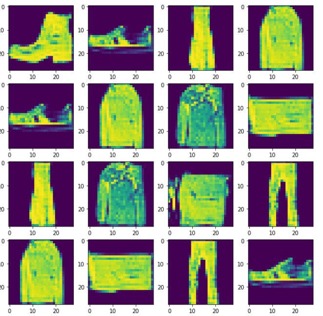

# Fashion MNIST GAN: Generative Adversarial Network for Fashion Image Generation

This script outlines the implementation of a Generative Adversarial Network (GAN) designed to generate fashion images using the Fashion MNIST dataset. The GAN consists of a generator and a discriminator, which are trained simultaneously in an adversarial manner.

